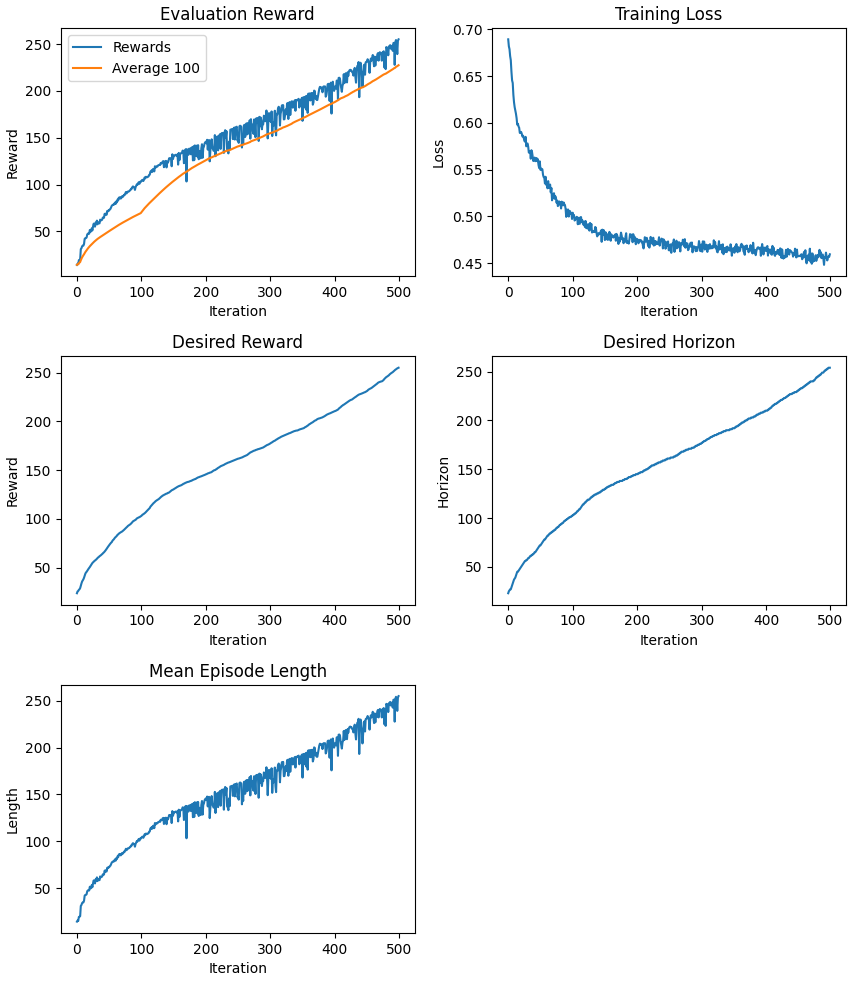

# Upside Down Reinforcement Learning

This project implements *Upside Down Reinforcement Learning* using PyTorch and Stable Baselines 3.
The original algorithm, as presented in the paper, has been extended to support additional features,
like multi-threading or weighted replay buffer sampling.
It also provides an interface similar to Stable Baselines algorithms, so it can be used mostly
analogously.

UDRL theory paper: <https://arxiv.org/pdf/1912.02875.pdf> 
UDRL implementation paper: <https://arxiv.org/pdf/1912.02877.pdf>

## Related Work

Various open source implementations already exist
[[1](https://github.com/BY571/Upside-Down-Reinforcement-Learning)]
[[2](https://github.com/drozzy/upsidedown)]
[[3](https://jscriptcoder.github.io/upside-down-rl/Upside-Down_RL.html)]
[[4](https://github.com/haron1100/Upside-Down-Reinforcement-Learning)]
[[5](https://github.com/bprabhakar/upside-down-reinforcement-learning)]
[[6](https://github.com/kage08/UDRL)]
[[7](https://github.com/parthchadha/upsideDownRL)]
[[8](https://github.com/AI-Core/Reinforcement-Learning)],
but most of them are difficult to extend and maintain, due to being written in a sloppy manner,
or are incorrect, e.g. not using multiplicative interactions or contain smaller bugs and issues.

This project was initially based on [BY571's implementation](https://github.com/BY571/Upside-Down-Reinforcement-Learning),
but was rewritten from scratch to fix bugs, potentially improve performance, providing a proper OOP
interface, and reuse code from Stable Baselines 3 where applicable.
Furthermore, the algorithm has been extended to support additional features, like multi-threading.

## Setup

Install dependencies using `pip install -r requirements.txt`.

For examples, see below.

## Action space

Only discrete action spaces are supported for now.

The code is mostly written to support other action spaces, especially since respective functionality
from SB3 is used where applicable, but it needs more work and testing to make them behave correctly.

## Features

CNNs are technically supported, but do not work because of exploding gradients.
Contributions to fix them are welcome.

CUDA is supported.

Additional features that were originally not included in the paper:

- Multi-threading
- Weighted replay buffer sampling - Useful for environments with vastly varying episode lengths
- Seamless trajectory compression in memory - Useful for environments with very long episodes and large
  observations, e.g. images
- Evaluation on multiple episodes
- Option to sample non-trailing trajectory slices for training

## Examples

See `train_cartpole.py` and `train_pong.py` for a Cart Pole and Pong example.

Note that Pong training will eventually get stuck because of CNNs being broken, as mentioned above.

For additional dependencies see here:
* Cart Pole: <https://gymnasium.farama.org/environments/classic_control/>
* Pong: <https://gymnasium.farama.org/environments/atari/>

### Example Cart Pole Evaluation

## Contributing

Contributions are welcome, especially to make CNNs work.
